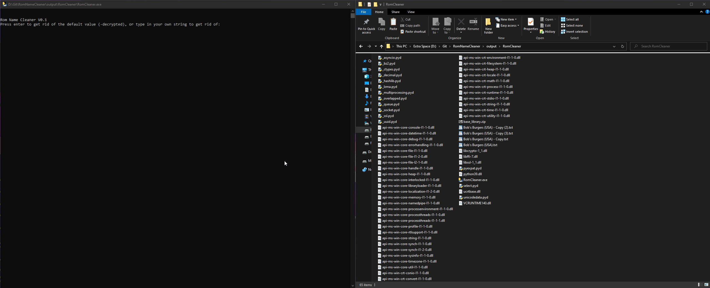

# RomNameCleaner
A dumb Python Script for quickly removing parts of a filename.

## How to setup (.exe version)
WARNING! I do not suggest using the .exe version. This is purely here just for n00bs. Git Gud.

Download the latest release and Unzip. (https://github.com/MoonRabbitDev/RomNameCleaner/releases/tag/V0.2)

Put any files that need to be converted into the folder named **PutFilesInHere**.

Run **RomCleaner - EXEVer.exe**.

## How to Setup (Source Code):
### Step 1 - Install Python
You can download the lastest release here: https://www.python.org/downloads/

### Step 2 - Download File
**Recommended:** Install Git (https://git-scm.com/downloads) and follow this tutorial: https://docs.github.com/en/repositories/creating-and-managing-repositories/cloning-a-repository

**Kindof shitty:** Code > Download as ZIP

### Step 3 - Setup

## Using the Program
Open **RomCleaner.py/RomCleaner - EXEVer.exe**, you will be given the following promit

Rom Name Cleaner V0.1
Press enter to get rid of the default value (-decrypted), or type in your own string to get rid of:

Type the word you would like to scrub from any file currently in the folder with the script. or press enter to get rid of -decrypted (handy for 3DS games)

### Step 4 - Menu
Next, you will be given the following menu

***Options:***

 ***Type 1 for Name Replacement Preview*** 
 
 ***2 for Auto-name Change***
 
 ***3 to Change Target String***
 
 ***4 to switch to Replacement Mode***
 
 ***5 to get rid of Illegal Characters***
 
 ***Type anything else to close the program***
 
 ***Enter your choice here:*** 

#### You can type one of the following commands to do a action. (Must hit enter to confirm).
Type **1** to *preview what the files would like if the changes were applied. (DOES NOT CHANGE THE FILE NAMES)*

Type **2** to *make the changes to the filename. (THERE IS NO UNDO. PLEASE USE THE PREVIEW TO CHECK IT.)*

Type **3** to *bring back the first menu, allowing you to target a different word.*

Type **4** to *change between Replace Mode or Remove Mod*

Type **5** to *get rid of any bad symbols in a folder (Useful for troubleshooting!)* 

**Typing anything besides 1,2,3,4, or 5 and hitting enter will close the program.**
